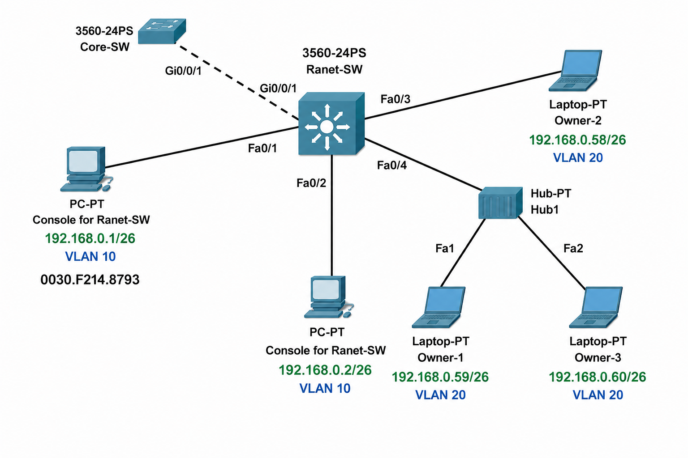
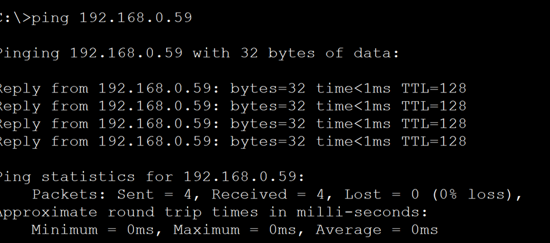
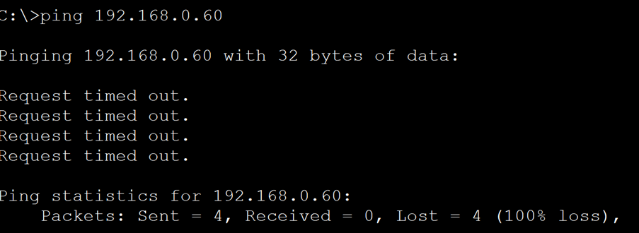
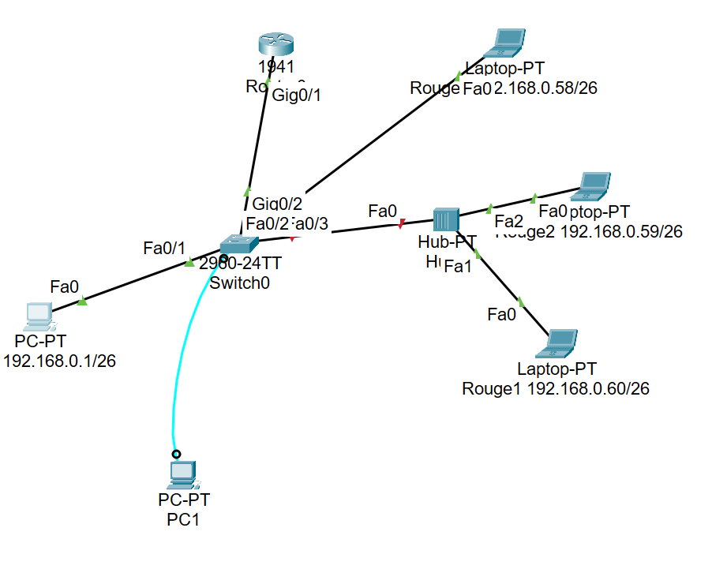

# Cisco Port Security Lab

## Projektziel

Ziel dieses Projekts war die Konfiguration von Cisco Port Security auf einem Switch, um unbefugten Netzwerkzugriff zu verhindern.

Dabei sollten folgende Anforderungen umgesetzt werden:

* Port Security auf den Access-Ports aktivieren
* Maximal eine MAC-Adresse pro Port zulassen
* Bei einer Sicherheitsverletzung den Port automatisch deaktivieren (Shutdown)
* Eine autorisierte MAC-Adresse mithilfe der Sticky-MAC-Funktion speichern
* Eine feste MAC-Adresse manuell konfigurieren
* Überprüfen, ob nicht autorisierte Geräte vom Netzwerkzugriff ausgeschlossen werden

## Erwartetes Ergebnis

Nicht autorisierte Geräte dürfen keine Verbindung zum Netzwerk herstellen. Bei einem Verstoß gegen die Port-Security-Richtlinien wird der entsprechende Port automatisch deaktiviert (Err-Disabled-Zustand).
## Verwendete Geräte

- Cisco Switch 2960
- Router
- PCs / Laptops
- Hub

## Netzwerktopologie

## Konfiguration


Zur Absicherung der Access-Ports wurde Cisco Port Security aktiviert.

```bash
Switch> enable
Switch# configure terminal

Switch(config)# interface range fa0/1-24
Switch(config-if-range)# switchport mode access
Switch(config-if-range)# switchport port-security
Switch(config-if-range)# switchport port-security maximum 1

Switch# copy running-config startup-config
Destination filename [startup-config]?
Anschließend wurde auf Fa0/1 die Sticky-MAC-Funktion aktiviert:

```bash
Switch(config)# interface fa0/1
Switch(config-if)# switchport port-security mac-address sticky
```

Für den Port Fa0/3 wurde eine feste MAC-Adresse konfiguriert:

```bash
Switch(config)# interface fa0/3
Switch(config-if)# switchport port-security mac-address 0030.F295.15C6
```

## Test der maximalen Anzahl von MAC-Adressen

### Erfolgreicher Zugriff



Der Ping war erfolgreich, da die erste erkannte MAC-Adresse den Port-Security-Richtlinien entsprach. Da auf dem Switch-Port bisher nur eine MAC-Adresse gelernt wurde, konnte die Kommunikation mit dem Netzwerk problemlos erfolgen.

### Blockierter Zugriff



Der Zugriff wurde blockiert, da auf dem Switch-Port maximal eine MAC-Adresse erlaubt war (`switchport port-security maximum 1`).

Da mehrere Geräte über einen Hub mit demselben Switch-Port verbunden waren, erkannte der Switch eine weitere MAC-Adresse auf diesem Port. Dies verstieß gegen die konfigurierte Port-Security-Richtlinie, wodurch die Kommunikation des zweiten Geräts verhindert wurde.

### Topologie nach dem Test



Nach der Port-Security-Verletzung wurde der Zugriff der zusätzlichen Geräte verhindert. Die Topologie zeigt den Netzwerkaufbau nach Durchführung der Tests.
## Sticky MAC-Adresse konfigurieren

```bash
Switch(config)# interface fa0/1
Switch(config-if)# switchport port-security mac-address sticky

```markdown
## Statische MAC-Adresse konfigurieren

```bash
Switch(config)# interface fa0/3
Switch(config-if)# switchport port-security mac-address 0030.f295.15C6

```markdown
## Überprüfung der MAC-Adresstabelle

Nach der Konfiguration von Sticky MAC und der statischen MAC-Adresse wurde die MAC-Adresstabelle überprüft.

```bash
Switch# show mac address-table

Vlan    Mac Address       Type      Ports
----    -----------       --------  -----
1       00d0.bc6a.db33    STATIC    Fa0/1
1       00e0.f913.e5d1    STATIC    Fa0/3
1       00e0.f922.da02    DYNAMIC   Gig0/2
```

### Überprüfung der Port-Security-Richtlinie

Der Ping zu **192.168.0.58** war nicht erfolgreich. Da auf **Fa0/3** eine feste MAC-Adresse konfiguriert wurde, wurde der Zugriff eines Geräts mit einer anderen MAC-Adresse blockiert.

Dies bestätigt die korrekte Funktion der Port-Security-Konfiguration.


## Abschließende Netzwerkstruktur


Die Topologie zeigt den finalen Netzwerkaufbau nach der Konfiguration von Port Security, Sticky MAC und statischen MAC-Adressen sowie nach den durchgeführten Tests.

## Fazit

In diesem Projekt wurde Cisco Port Security erfolgreich implementiert und getestet.

Die Tests haben gezeigt, dass:

- nur autorisierte MAC-Adressen Zugriff auf das Netzwerk erhalten,
- die Anzahl der MAC-Adressen pro Port begrenzt werden kann,
- Sticky MAC-Adressen automatisch gespeichert werden können,
- feste MAC-Adressen manuell konfiguriert werden können,
- die Netzwerksicherheit durch Port Security deutlich erhöht wird.

Das Projekt demonstriert den praktischen Einsatz von Cisco Port Security in Unternehmensnetzwerken.
=======
# Cisco-port-security
Cisco Packet Tracer project demonstrating Port Security configuration and testing on a switch.
>>>>>>> d7335fc25c9de6e7d585887e2b9152b5c844a9e5
